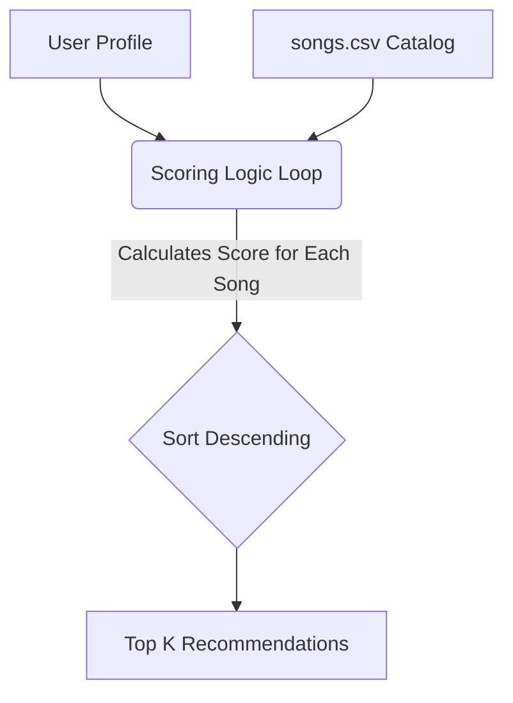

# 🎵 Music Recommender Simulation

## Project Summary

In this project you will build and explain a small music recommender system.

Your goal is to:

- Represent songs and a user "taste profile" as data
- Design a scoring rule that turns that data into recommendations
- Evaluate what your system gets right and wrong
- Reflect on how this mirrors real world AI recommenders

This simulation implements a basic **Content-Based Filtering** recommendation engine. It takes a user's taste profile and calculates a "vibe match" score by comparing their preferences directly against the audio attributes of each available song, allowing us to generate personalized music suggestions.

---

## How The System Works

In the real world, music platforms like Spotify or YouTube use a mix of **Collaborative Filtering** (matching you with users who have similar tastes based on playback history) and **Content-Based Filtering** (matching songs with similar audio properties). This simulation prioritizes the **Content-Based Filtering** approach. We don't have simulated other users' listening histories, so we rely entirely on the songs' intrinsic characteristics to make predictions.

**Data & Features Used:**
- **Song Features:** We utilize 9 core traits! `genre`, `mood`, `energy`, `valence`, plus 5 Challenge Features (`popularity`, `release_decade`, `detailed_mood`, `vocal_presence`, and `instrumentalness`).
- **UserProfile Information:** Stores the user's preferred values for all 9 traits so the system has a complete musical mapping of their intent.

**The Algorithm (Scoring & Ranking):**
1. **Scoring Rule:** The recommender calculates a total score for *each individual song*. 
   - Categorical traits (`genre`, `mood`, `detailed_mood`, `release_decade`) get heavily weighted bonus points if they match the user exactly (e.g., matching a highly specific `detailed_mood` = +1.5 points). In our latest experiment, genre match weight was adjusted to +1.0.
   - Numerical traits (`energy`, `valence`, `popularity`, etc.) use a mathematical distance metric: `1.0 - absolute(user_preference - song_attribute)`. The closer the song is to the user's target math, the more points it earns! We've also doubled the weight of the energy score match.
2. **Recommendation Modes (Strategy Pattern):** We've introduced different recommendation strategies that apply targeted score multipliers or bonuses:
   - **Base Strategy:** Standard scoring.
   - **Genre First Strategy:** Awards an extra +1.5 bonus to tracks matching the user's favorite genre.
   - **Mood First Strategy:** Awards an extra +1.5 bonus to tracks matching the user's favorite mood.
   - **Energy Focused Strategy:** Awards a proportional bonus (up to +1.5) based on how close the song's energy is to the user's target.
3. **Diversity Penalties (Anti-Monotony):** To prevent playlists from being dominated by a single artist or genre, a greedy selection algorithm applies multiplicative penalties (`artist_penalty` and `genre_penalty`) to tracks from an artist/genre that has already been selected. It also supports hard caps (`max_per_artist`, `max_per_genre`).
4. **Ranking Rule:** After scoring and penalizing, the system sorts them by their adjusted scores in descending order and recommends the top tracks. Ties are broken deterministically using the song ID.

**Data Flow Visualization:**



**Potential Biases & Limitations:**
This algorithm heavily prioritizes exact string matches (+1.5 points for detailed mood). As a result, it has a built-in bias toward a user's *stated* metadata. It might ignore a fantastic, perfectly energy-matched song simply because it falls into a different categorical bucket.

**Simulation Output Screenshot:**

```text
Loaded songs: 18

========== Top recommendations for: High-Energy Pop ==========

--- Top for High-Energy Pop ---
|   # | Title             | Artist        |   Score | Reasons                                                                          |
|-----|-------------------|---------------|---------|----------------------------------------------------------------------------------|
|   1 | Sunrise City      | Neon Echo     |   10.15 | genre match (+1.0), mood match (+1.0), detailed mood match (+1.5), 2010s era ... |
|   2 | Rooftop Lights    | Indigo Parade |    9.21 | mood match (+1.0), detailed mood match (+1.5), 2010s era match (+1.0), popula... |
|   3 | Gym Hero          | Max Pulse     |    6.41 | genre match (+1.0), detailed mood match (+1.5), popularity match (+0.90), voc... |
|   4 | Reggae Vibes      | Island Sound  |    7.50 | mood match (+1.0), detailed mood match (+1.5), popularity match (+0.85), voca... |
|   5 | Deep House Groove | DJ Orbit      |    7.27 | detailed mood match (+1.5), 2010s era match (+1.0), popularity match (+0.92),... |
==================================================================

========== Top recommendations for: Chill Lofi ==========

--- Top for Chill Lofi ---
|   # | Title              | Artist         |   Score | Reasons                                                                          |
|-----|--------------------|----------------|---------|----------------------------------------------------------------------------------|
|   1 | Midnight Coding    | LoRoom         |   10.15 | genre match (+1.0), mood match (+1.0), detailed mood match (+1.5), 2020s era ... |
|   2 | Focus Flow         | LoRoom         |    5.05 | genre match (+1.0), detailed mood match (+1.5), 2020s era match (+1.0), popul... |
|   3 | Library Rain       | Paper Lanterns |    5.47 | genre match (+1.0), mood match (+1.0), 2020s era match (+1.0), popularity mat... |
|   4 | Spacewalk Thoughts | Orbit Bloom    |    7.81 | mood match (+1.0), detailed mood match (+1.5), popularity match (+0.70), voca... |
|   5 | Classical Study    | String Quartet |    6.85 | detailed mood match (+1.5), popularity match (+0.85), vocal match (+0.90), in... |
==================================================================
```

---

## Getting Started

### Setup

1. Create a virtual environment (optional but recommended):

   ```bash
   python -m venv .venv
   source .venv/bin/activate      # Mac or Linux
   .venv\Scripts\activate         # Windows

2. Install dependencies

```bash
pip install -r requirements.txt
```

3. Run the app:

```bash
python -m src.main
```

The script will prompt you to enter **Interactive Mode**. If you type `y`, you can answer a short questionnaire to dynamically build your custom taste profile on the fly! Otherwise, it will print recommendations for three standard simulated profiles.

### Running Tests

Run the starter tests with:

```bash
pytest
```

You can add more tests in `tests/test_recommender.py`.

---

## Experiments You Tried

Here are the experiments and enhancements recently added to the system:

- **Advanced Song Features:** Extended the baseline catalog with 5 advanced attributes (`popularity`, `release_decade`, `detailed_mood`, `vocal_presence`, and `instrumentalness`). Adding granular tracking data like these allowed the math to create highly robust recommendations that mirror commercial applications.
- **Scoring Weights adjustments:** Halved the baseline genre weight (from +2.0 to +1.0) and doubled the baseline energy weight. This prevents generic genre tags from entirely overshadowing a track's audio profile.
- **Strategy Pattern / Recommendation Modes:** Implemented multiple scoring strategies (`GenreFirst`, `MoodFirst`, `EnergyFocused`). Each mode wraps the base score and applies a focused bonus, allowing the recommender to drastically alter the ranked output depending on what signal we prioritize.
- **Diversity Penalties:** Implemented a greedy selection algorithm that applies multiplicative score penalties for repeat artists and genres to force playlist variety and break up homogeneous "bubbles."
- **Stress-Tested with Adversarial Profiles:** Tested conflicting input profiles (like an "Adversarial Metal" fan requesting low energy and high valence). This exposed how strict numerical filtering can unintentionally filter out contextually relevant art based purely on math restrictions.
- **Enhanced CLI Output:** Integrated the `tabulate` library to dynamically generate beautiful, readable ASCII tables for the terminal output, ensuring reasons and scores are cleanly aligned and truncated.
- **Interactive Terminal Questionnaire:** Added an interactive CLI prompt to `src/main.py` that asks users for their name, preferred genre, mood, and scaled numeric preferences (1-10) to generate a custom Taste Profile on the fly.

---

## Limitations and Risks

Summarize some limitations of your recommender.

Examples:

- It only works on a tiny catalog
- It does not understand lyrics or language
- It might over favor one genre or mood

You will go deeper on this in your model card.

---

## Reflection

Read and complete `model_card.md`:

[**Model Card**](model_card.md)

Write 1 to 2 paragraphs here about what you learned:

- about how recommenders turn data into predictions:
I learned that recommenders rely on rigid mathematical distance metrics and weighted score loops. Comparing my "High-Energy Pop" profile to the "Chill Lofi" profile proved this beautifully—the Pop profile triggered a sweep of fast-paced, high valence tracks, while the Lofi profile naturally sank to the bottom of the energy pool. The algorithm simply looks at exactly what we explicitly weigh as "valuable" (like genre matching or numerical energy proximity) and blindly sorts based on those resulting distances.

- about where bias or unfairness could show up in systems like this:
The biggest surprise came from my "Adversarial Metal" test. Because I asked for Metal but inputted conflicting numerical preferences (extremely low energy, high valence), the system actually refused to return the only Metal song in my catalog. Instead, it surfaced a Reggae song because it prioritized the math rules over the cultural intent of the genre. This exposes a massive bias: strict numerical filtering creates "bubbles" that can unintentionally discriminate against or filter out highly relevant art just because it misses a hard-coded data threshold.
---

## 7. `model_card_template.md`

Combines reflection and model card framing from the Module 3 guidance. :contentReference[oaicite:2]{index=2}  

```markdown
# 🎧 Model Card - Music Recommender Simulation

## 1. Model Name

Give your recommender a name, for example:

> VibeFinder 1.0

---

## 2. Intended Use

- What is this system trying to do
- Who is it for

Example:

> This model suggests 3 to 5 songs from a small catalog based on a user's preferred genre, mood, and energy level. It is for classroom exploration only, not for real users.

---

## 3. How It Works (Short Explanation)

Describe your scoring logic in plain language.

- What features of each song does it consider
- What information about the user does it use
- How does it turn those into a number

Try to avoid code in this section, treat it like an explanation to a non programmer.

---

## 4. Data

Describe your dataset.

- How many songs are in `data/songs.csv`
- Did you add or remove any songs
- What kinds of genres or moods are represented
- Whose taste does this data mostly reflect

---

## 5. Strengths

Where does your recommender work well

You can think about:
- Situations where the top results "felt right"
- Particular user profiles it served well
- Simplicity or transparency benefits

---

## 6. Limitations and Bias

Where does your recommender struggle

Some prompts:
- Does it ignore some genres or moods
- Does it treat all users as if they have the same taste shape
- Is it biased toward high energy or one genre by default
- How could this be unfair if used in a real product

---

## 7. Evaluation

How did you check your system

Examples:
- You tried multiple user profiles and wrote down whether the results matched your expectations
- You compared your simulation to what a real app like Spotify or YouTube tends to recommend
- You wrote tests for your scoring logic

You do not need a numeric metric, but if you used one, explain what it measures.

---

## 8. Future Work

If you had more time, how would you improve this recommender

Examples:

- Add support for multiple users and "group vibe" recommendations
- Balance diversity of songs instead of always picking the closest match
- Use more features, like tempo ranges or lyric themes

---

## 9. Personal Reflection

A few sentences about what you learned:

- What surprised you about how your system behaved
- How did building this change how you think about real music recommenders
- Where do you think human judgment still matters, even if the model seems "smart"

