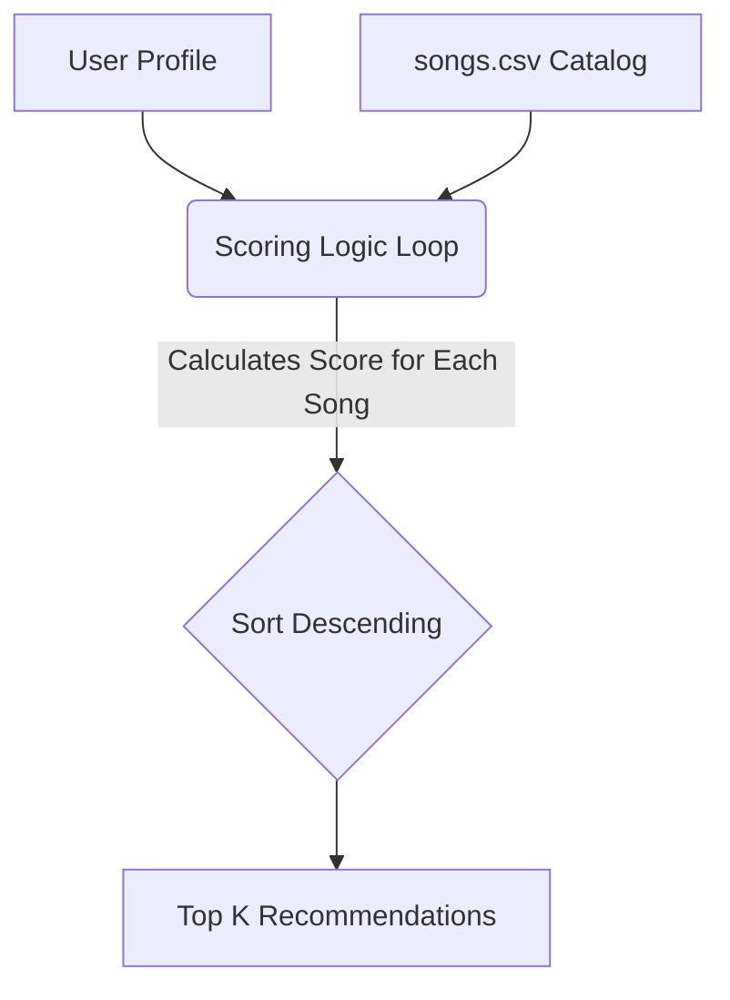

# 🎵 Music Recommender Simulation

## Project Summary

In this project you will build and explain a small music recommender system.

Your goal is to:

- Represent songs and a user "taste profile" as data
- Design a scoring rule that turns that data into recommendations
- Evaluate what your system gets right and wrong
- Reflect on how this mirrors real world AI recommenders

This simulation implements a basic **Content-Based Filtering** recommendation engine. It takes a user's taste profile and calculates a "vibe match" score by comparing their preferences directly against the audio attributes of each available song, allowing us to generate personalized music suggestions.

---

## How The System Works

In the real world, music platforms like Spotify or YouTube use a mix of **Collaborative Filtering** (matching you with users who have similar tastes based on playback history) and **Content-Based Filtering** (matching songs with similar audio properties). This simulation prioritizes the **Content-Based Filtering** approach. We don't have simulated other users' listening histories, so we rely entirely on the songs' intrinsic characteristics to make predictions.

**Data & Features Used:**
- **Song Features:** `genre` (e.g., pop, lofi), `mood` (e.g., happy, chill), `energy` (0.0 to 1.0 scale), and `valence` (musical positiveness, 0.0 to 1.0).
- **UserProfile Information:** Stores the user's preferred `genre`, `mood`, target `energy`, and target `valence`.

**The Algorithm (Scoring & Ranking):**
1. **Scoring Rule:** The recommender calculates a total score for *each individual song*. 
   - Categorical traits (`genre`, `mood`) get fixed bonus points if they match the user exactly. We apply **weights** here (e.g., matching genre = +2.0 points, matching mood = +1.0 point), since returning the corresponding genre is typically the strongest indicator of a good match.
   - Numerical traits (`energy`, `valence`) use a mathematical distance metric: `1.0 - absolute(user_preference - song_attribute)`. The closer the song is to the user's target, the more points it earns (up to +1.0 point each).
2. **Ranking Rule:** After scoring every song in the catalog, the system sorts them by total score in descending order and recommends the top highest-scoring tracks.

**Data Flow Visualization:**



**Potential Biases & Limitations:**
This algorithm heavily prioritizes exact genre matches (+2.0 points). As a result, it has a built-in bias toward a user's *stated* favorite genre. It might ignore a fantastic, perfectly mood-matched and energy-matched song simply because it falls into a different genre. It also assumes our numerical metrics (like `energy`) perfectly capture a user's intent, which isn't always true in the real world. Ensure you experiment with these weights when fine-tuning the system!

**Simulation Output Screenshot:**

```text
Loaded songs: 18

========== Top recommendations for: High-Energy Pop ==========
Sunrise City - Score: 4.93
Because: genre match (+2.0), mood match (+1.0), energy match (+0.97), valence match (+0.96)
Gym Hero - Score: 3.89
Because: genre match (+2.0), energy match (+0.92), valence match (+0.97)
Rooftop Lights - Score: 2.90
Because: mood match (+1.0), energy match (+0.91), valence match (+0.99)
Reggae Vibes - Score: 2.70
Because: mood match (+1.0), energy match (+0.75), valence match (+0.95)
Deep House Groove - Score: 1.95
Because: energy match (+1.00), valence match (+0.95)
==================================================================

========== Top recommendations for: Chill Lofi ==========
Library Rain - Score: 4.85
Because: genre match (+2.0), mood match (+1.0), energy match (+0.95), valence match (+0.90)
Midnight Coding - Score: 4.82
Because: genre match (+2.0), mood match (+1.0), energy match (+0.88), valence match (+0.94)
Focus Flow - Score: 3.81
Because: genre match (+2.0), energy match (+0.90), valence match (+0.91)
Spacewalk Thoughts - Score: 2.83
Because: mood match (+1.0), energy match (+0.98), valence match (+0.85)
Acoustic Sunset - Score: 2.00
Because: energy match (+1.00), valence match (+1.00)
==================================================================

========== Top recommendations for: Adversarial Metal ==========
Reggae Vibes - Score: 2.45
Because: mood match (+1.0), energy match (+0.50), valence match (+0.95)
Heavy Metal Nightmare - Score: 2.42
Because: genre match (+2.0), energy match (+0.12), valence match (+0.30)
Rooftop Lights - Score: 2.25
Because: mood match (+1.0), energy match (+0.34), valence match (+0.91)
Sunrise City - Score: 2.22
Because: mood match (+1.0), energy match (+0.28), valence match (+0.94)
Spacewalk Thoughts - Score: 1.57
Because: energy match (+0.82), valence match (+0.75)
==================================================================
```

---

## Getting Started

### Setup

1. Create a virtual environment (optional but recommended):

   ```bash
   python -m venv .venv
   source .venv/bin/activate      # Mac or Linux
   .venv\Scripts\activate         # Windows

2. Install dependencies

```bash
pip install -r requirements.txt
```

3. Run the app:

```bash
python -m src.main
```

### Running Tests

Run the starter tests with:

```bash
pytest
```

You can add more tests in `tests/test_recommender.py`.

---

## Experiments You Tried

Use this section to document the experiments you ran. For example:

- What happened when you changed the weight on genre from 2.0 to 0.5
- What happened when you added tempo or valence to the score
- How did your system behave for different types of users

---

## Limitations and Risks

Summarize some limitations of your recommender.

Examples:

- It only works on a tiny catalog
- It does not understand lyrics or language
- It might over favor one genre or mood

You will go deeper on this in your model card.

---

## Reflection

Read and complete `model_card.md`:

[**Model Card**](model_card.md)

Write 1 to 2 paragraphs here about what you learned:

- about how recommenders turn data into predictions:
I learned that recommenders rely on rigid mathematical distance metrics and weighted score loops. Comparing my "High-Energy Pop" profile to the "Chill Lofi" profile proved this beautifully—the Pop profile triggered a sweep of fast-paced, high valence tracks, while the Lofi profile naturally sank to the bottom of the energy pool. The algorithm simply looks at exactly what we explicitly weigh as "valuable" (like genre matching or numerical energy proximity) and blindly sorts based on those resulting distances.

- about where bias or unfairness could show up in systems like this:
The biggest surprise came from my "Adversarial Metal" test. Because I asked for Metal but inputted conflicting numerical preferences (extremely low energy, high valence), the system actually refused to return the only Metal song in my catalog. Instead, it surfaced a Reggae song because it prioritized the math rules over the cultural intent of the genre. This exposes a massive bias: strict numerical filtering creates "bubbles" that can unintentionally discriminate against or filter out highly relevant art just because it misses a hard-coded data threshold.
---

## 7. `model_card_template.md`

Combines reflection and model card framing from the Module 3 guidance. :contentReference[oaicite:2]{index=2}  

```markdown
# 🎧 Model Card - Music Recommender Simulation

## 1. Model Name

Give your recommender a name, for example:

> VibeFinder 1.0

---

## 2. Intended Use

- What is this system trying to do
- Who is it for

Example:

> This model suggests 3 to 5 songs from a small catalog based on a user's preferred genre, mood, and energy level. It is for classroom exploration only, not for real users.

---

## 3. How It Works (Short Explanation)

Describe your scoring logic in plain language.

- What features of each song does it consider
- What information about the user does it use
- How does it turn those into a number

Try to avoid code in this section, treat it like an explanation to a non programmer.

---

## 4. Data

Describe your dataset.

- How many songs are in `data/songs.csv`
- Did you add or remove any songs
- What kinds of genres or moods are represented
- Whose taste does this data mostly reflect

---

## 5. Strengths

Where does your recommender work well

You can think about:
- Situations where the top results "felt right"
- Particular user profiles it served well
- Simplicity or transparency benefits

---

## 6. Limitations and Bias

Where does your recommender struggle

Some prompts:
- Does it ignore some genres or moods
- Does it treat all users as if they have the same taste shape
- Is it biased toward high energy or one genre by default
- How could this be unfair if used in a real product

---

## 7. Evaluation

How did you check your system

Examples:
- You tried multiple user profiles and wrote down whether the results matched your expectations
- You compared your simulation to what a real app like Spotify or YouTube tends to recommend
- You wrote tests for your scoring logic

You do not need a numeric metric, but if you used one, explain what it measures.

---

## 8. Future Work

If you had more time, how would you improve this recommender

Examples:

- Add support for multiple users and "group vibe" recommendations
- Balance diversity of songs instead of always picking the closest match
- Use more features, like tempo ranges or lyric themes

---

## 9. Personal Reflection

A few sentences about what you learned:

- What surprised you about how your system behaved
- How did building this change how you think about real music recommenders
- Where do you think human judgment still matters, even if the model seems "smart"

